# SChill 功能流程图（图片版）

## 目录
1. [项目架构概述](#项目架构概述)
2. [数据库表关系](#数据库表关系)
3. [用户服务接口流程](#用户服务接口流程)
4. [内容服务接口流程](#内容服务接口流程)
5. [评论服务接口流程](#评论服务接口流程)
6. [关系服务接口流程](#关系服务接口流程)
7. [Kafka 消息流程](#kafka-消息流程)

---

## 如何查看和导出图片

### 方式1：使用 VS Code 插件
1. 安装 "Markdown Preview Mermaid Support" 插件
2. 在 VS Code 中打开此文件
3. 右键选择 "Markdown: Open Preview to the Side"
4. 右键预览中的图表 → "Export to SVG" 或 "Export to PNG"

### 方式2：使用在线工具
访问 https://mermaid.live/，将每个图表的代码粘贴进去，即可预览和下载图片。

---

## 项目架构概述

### 整体架构图

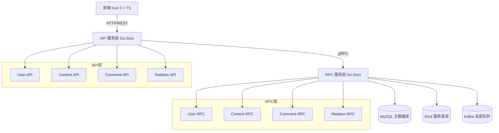

---

## 数据库表关系

### ER 图

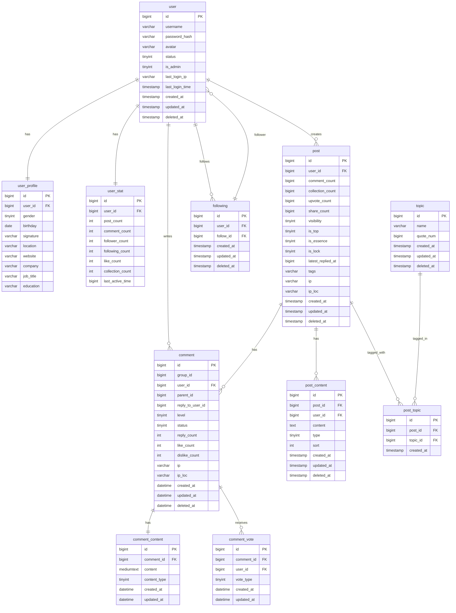

---

## 用户服务接口流程

### 1. 用户注册 (Register)

**文件位置**: `service/user/rpc/internal/logic/registerlogic.go`

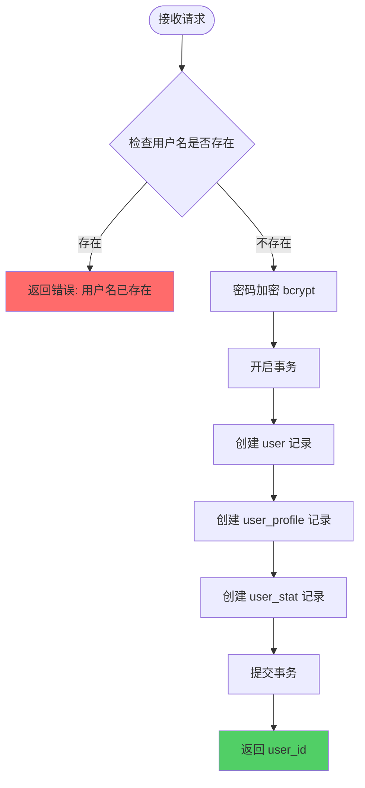

**数据转换**:
- 输入: `RegisterReq { Username, Password }`
- 输出: `RegisterResp { UserId }`
- 数据库写入: user, user_profile, user_stat

---

### 2. 用户登录 (Login)

**文件位置**: `service/user/rpc/internal/logic/loginlogic.go`

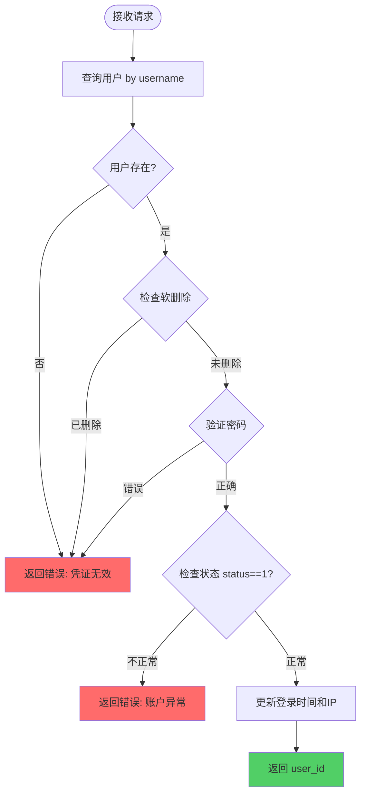

**数据转换**:
- 输入: `LoginReq { Username, Password }`
- 输出: `LoginResp { UserId }`
- 数据库读取: user 表
- 数据库更新: user.last_login_time, user.last_login_ip

---

### 3. 获取用户统计 (GetUserStat)

**文件位置**: `service/user/rpc/internal/logic/getuserstatlogic.go`

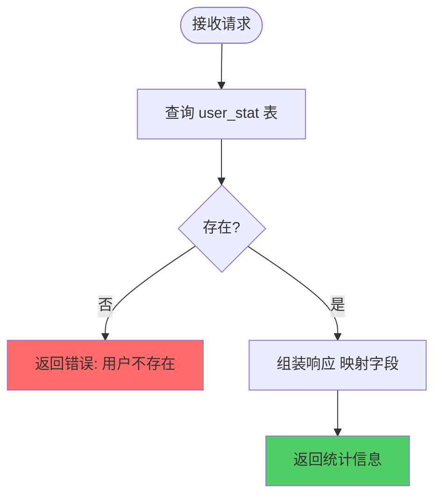

**数据转换**:
- 输入: `GetUserStatReq { UserId }`
- 输出: `GetUserStatResp { Stat { UserId, PostCount, CommentCount, FollowerCount, FollowingCount, LikeCount, CollectionCount, LastActiveTime } }`

---

## 内容服务接口流程

### 1. 创建帖子 (CreatePost)

**文件位置**: `service/content/rpc/internal/logic/create_post_logic.go`

```mermaid
flowchart TD
    Start([接收请求]) --> Validate{参数校验<br/>title/contents不为空}
    Validate -->|不通过| Err1[返回错误]
    Validate -->|通过| BeginTx[开启事务]
    BeginTx --> CreatePost[创建 post 主记录]
    CreatePost --> CreateTitle[创建标题 content type=1]
    CreateTitle --> HasCover{有封面?}
    HasCover -->|是| CreateCover[创建封面 content type=3]
    HasCover -->|否| CreateContents
    CreateCover --> CreateContents[遍历创建正文内容 type=2]
    CreateContents --> HasTopics{有话题?}
    HasTopics -->|是| ProcessTopics[处理话题]
    HasTopics -->|否| CommitTx
    
    subgraph 话题处理
        ProcessTopics --> ForEachTopic[遍历每个话题]
        ForEachTopic --> TopicExist{话题已存在?}
        TopicExist -->|是| IncQuote[quote_num + 1]
        TopicExist -->|否| CreateTopic[创建新话题 quote_num=1]
        IncQuote --> CreatePostTopic
        CreateTopic --> CreatePostTopic[创建 post_topic 关联]
    end
    
    CreatePostTopic --> CommitTx[提交事务]
    CommitTx --> QueryNewPost[查询新帖子ID]
    QueryNewPost --> BuildMsg[构造Kafka消息 {user_id, post_id}]
    BuildMsg --> SendKafka[发送到 post-created 主题]
    SendKafka --> Return[返回 post_id]
    
    style Err1 fill:#ff6b6b
    style Return fill:#51cf66
```

**数据转换**:
- 输入: `CreatePostReq { UserId, Title, Cover, Contents [{Type, Content, Sort}], Topics [], Visibility, Tags }`
- 输出: `CreatePostResp { PostId }`
- 数据库写入（事务内）: post, post_content, topic, post_topic
- Kafka 消息: 发送到 `post-created` 主题

---

### 2. 删除帖子 (DeletePost)

**文件位置**: `service/content/rpc/internal/logic/delete_post_logic.go`

```mermaid
flowchart TD
    Start([接收请求]) --> QueryPost[查询帖子]
    QueryPost --> Exist{帖子存在?}
    Exist -->|否| Err1[返回错误: 帖子不存在]
    Exist -->|是| CheckPermission{权限校验<br/>post.user_id == user_id?}
    CheckPermission -->|否| Err2[返回错误: 无权限]
    CheckPermission -->|是| BeginTx[开启事务]
    
    BeginTx --> QueryPostTopics[查询关联的 post_topic]
    QueryPostTopics --> ForEachPT[遍历减少 topic.quote_num]
    ForEachPT --> DeletePT[删除 post_topic 记录]
    DeletePT --> DeleteContent[删除 post_content 记录]
    DeleteContent --> DeletePost[删除 post 记录]
    DeletePost --> CommitTx[提交事务]
    
    CommitTx --> BuildMsg[构造Kafka消息 {user_id, post_id}]
    BuildMsg --> SendKafka[发送到 post-deleted 主题]
    SendKafka --> Return[返回成功]
    
    style Err1 fill:#ff6b6b
    style Err2 fill:#ff6b6b
    style Return fill:#51cf66
```

**数据转换**:
- 输入: `DeletePostReq { PostId, UserId }`
- 输出: `DeletePostResp { Success }`
- 数据库操作（事务内）: 更新 topic.quote_num, 删除 post_topic/post_content/post
- Kafka 消息: 发送到 `post-deleted` 主题

---

### 3. 获取帖子详情 (GetPostDetail)

**文件位置**: `service/content/rpc/internal/logic/get_post_detail_logic.go`

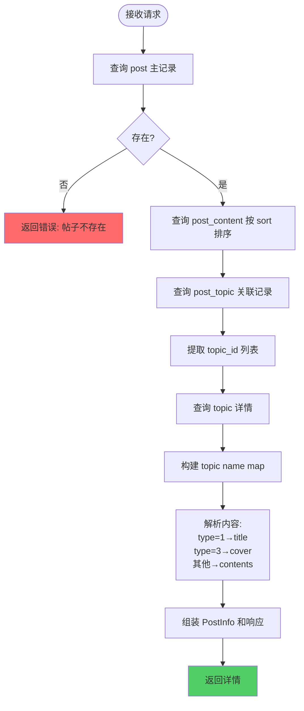

**数据转换**:
- 输入: `GetPostDetailReq { PostId }`
- 输出: `GetPostDetailResp { Post {}, Contents [], Topics [] }`

---

### 4. 获取帖子列表 (GetPostList)

**文件位置**: `service/content/rpc/internal/logic/get_post_list_logic.go`

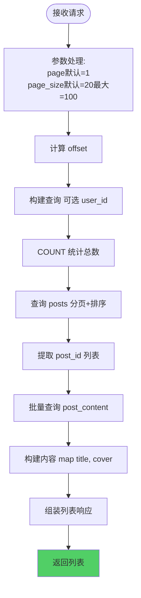

**数据转换**:
- 输入: `GetPostListReq { Page, PageSize, UserId }`
- 输出: `GetPostListResp { Total, List [] }`

---

## 评论服务接口流程

### 1. 创建评论 (CreateComment) - 待实现

**文件位置**: `service/comment/rpc/internal/logic/createcommentlogic.go`

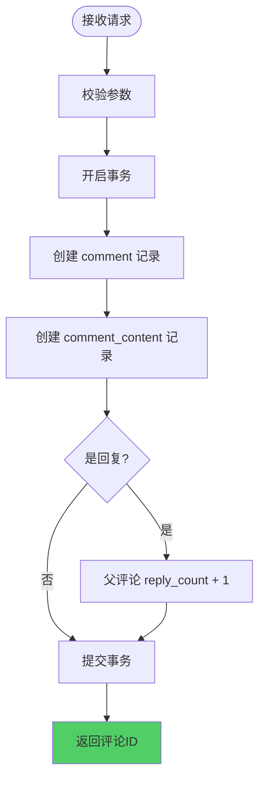

**预计数据转换**:
- 输入: `CreateCommentReq { GroupId, UserId, Content, ParentId, ReplyToUserId }`
- 输出: `CreateCommentResp { CommentId }`
- 数据库写入（事务内）: comment, comment_content

---

## 关系服务接口流程

### 1. 关注用户 (Follow)

**文件位置**: `service/relation/rpc/internal/logic/followlogic.go`

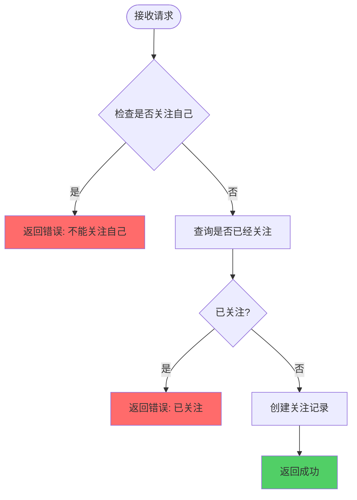

**数据转换**:
- 输入: `FollowReq { UserId, TargetUserId }`
- 输出: `FollowResp { Success }`
- 数据库写入: `following { user_id, follow_id }`

---

### 2. 取消关注 (Unfollow)

**文件位置**: `service/relation/rpc/internal/logic/unfollowlogic.go`

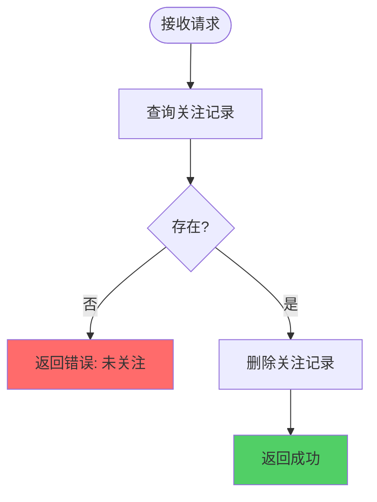

**数据转换**:
- 输入: `UnfollowReq { UserId, TargetUserId }`
- 输出: `UnfollowResp { Success }`
- 数据库删除: `following` 记录

---

## Kafka 消息流程

### 整体消息流架构

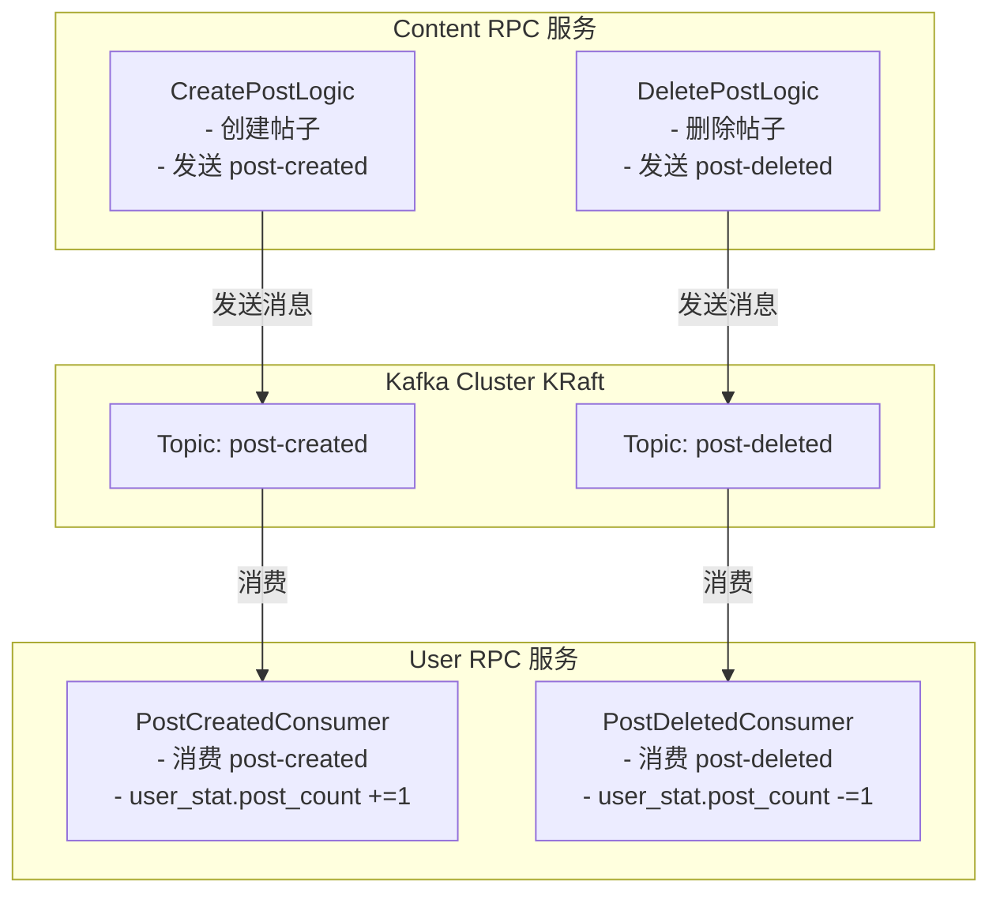

---

### 1. Post-Created 消息消费流程

**文件位置**: `service/user/rpc/internal/mqs/postcreated.go`

```mermaid
flowchart TD
    Start([Kafka Consumer 接收消息]) --> ParseJSON[解析 JSON {user_id, post_id}]
    ParseJSON --> BeginTx[开启事务]
    BeginTx --> QueryStat[查询 user_stat]
    QueryStat --> Exist{存在?}
    Exist -->|否| CreateNew[创建新记录 post_count=1]
    Exist -->|是| IncCount[post_count +=1]
    CreateNew --> CommitTx
    IncCount --> CommitTx[提交事务]
    CommitTx --> MarkOffset[Mark Offset]
    
    style MarkOffset fill:#51cf66
```

**数据转换**:
- Kafka 消息: `{ user_id, post_id }`
- 数据库操作: `user_stat.post_count += 1` (事务)

---

### 2. Post-Deleted 消息消费流程

**文件位置**: `service/user/rpc/internal/mqs/postdeleted.go`

```mermaid
flowchart TD
    Start([Kafka Consumer 接收消息]) --> ParseJSON[解析 JSON {user_id, post_id}]
    ParseJSON --> BeginTx[开启事务]
    BeginTx --> QueryStat[查询 user_stat]
    QueryStat --> Exist{存在?}
    Exist -->|否| CreateNew[创建新记录 post_count=0]
    Exist -->|是| CheckGT0{post_count > 0?}
    CreateNew --> CommitTx
    CheckGT0 -->|是| DecCount[post_count -=1]
    CheckGT0 -->|否| Skip[跳过 已为0]
    DecCount --> CommitTx
    Skip --> CommitTx[提交事务]
    CommitTx --> MarkOffset[Mark Offset]
    
    style MarkOffset fill:#51cf66
```

**数据转换**:
- Kafka 消息: `{ user_id, post_id }`
- 数据库操作: `user_stat.post_count -= 1` (仅当 post_count > 0 时，事务)

---

## 总结

### 关键设计模式

| 模式 | 说明 |
|------|------|
| API + RPC 双层架构 | API 层负责 REST 接口，RPC 层负责业务逻辑和数据库操作 |
| 数据库事务 | 涉及多表操作的接口都使用事务保证一致性 |
| Kafka 事件驱动 | 帖子创建/删除通过 Kafka 异步更新用户统计 |
| 软删除 | 核心表都使用 `deleted_at` 实现软删除 |

### 事务使用场景

| 接口 | 涉及表 | 原因 |
|------|--------|------|
| Register | user, user_profile, user_stat | 必须同时创建三个表记录 |
| CreatePost | post, post_content, topic, post_topic | 帖子内容、话题关联必须一致 |
| DeletePost | topic, post_topic, post_content, post | 删除操作必须按顺序回滚 |
| PostCreatedConsumer | user_stat | 计数更新需要事务保护 |
| PostDeletedConsumer | user_stat | 计数更新需要事务保护 |

### Kafka 主题

| 主题 | 生产者 | 消费者 | 用途 |
|------|--------|--------|------|
| post-created | Content RPC | User RPC | 帖子创建，增加发帖数 |
| post-deleted | Content RPC | User RPC | 帖子删除，减少发帖数 |
